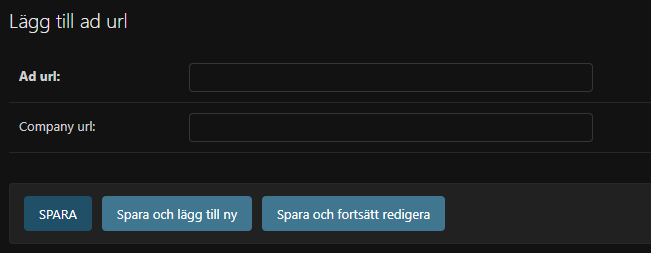
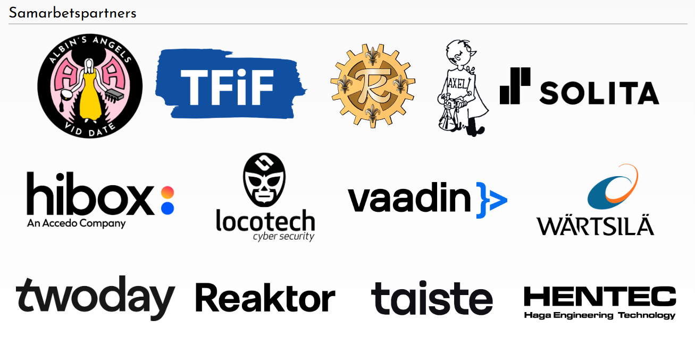

# Ads Admin Guide

## Purpose
The Ads app controls the rotating banner graphics that appear on the public front page. Each entry simply links a banner image URL to an optional company landing page URL.

## Access
1. Sign in to the Django admin (`/admin`).
2. Go to **Ads › Ad urls** (`/admin/ads/adurl/`). The list shows every banner and the link it clicks through to.

## Add a New Banner
1. Click **Add ad url**.
2. Fill in the fields:
   - **Ad url** – the direct link to the hosted banner asset (PNG/JPG/GIF). Use an HTTPS URL that is already uploaded to the media server or an approved CDN.
   - **Company url** – where visitors should land when they click the banner. Leave blank if the banner is purely decorative.
3. Click **Save**. The banner is live immediately.

## Update or Hide an Existing Banner
1. Click the banner entry from the list.
2. Replace the **Ad url** or **Company url** as needed.
3. Click **Save**. Use **Delete** if the campaign is over.

## Tips for Non‑Technical Editors
- Keep banner dimensions consistent with the existing creatives to avoid layout jumps.
- Always test the company URL in a new browser tab before saving.
- Remove stale campaigns promptly; the home page simply cycles through whatever records exist.

