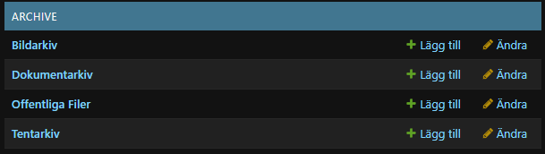
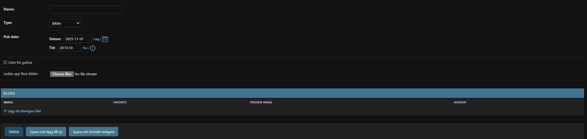

# Archive Admin Guide

## Purpose
Store and present historical material: photo galleries, document archives, exam libraries, and (when using S3) public files.

## Apps & Terms
- **Picture Collection** – image galleries sorted by year. Each collection contains many photos.
- **Document Collection** – PDF or other documents grouped by year/topic.
- **Exam Collection** – student exam archives.
- **Public Collection** – files intended for anonymous download (only when S3 uploads are enabled).

## Adding a Picture Gallery
1. Visit **Archive › Picture collections** (`/admin/archive/picturecollection/`).
2. Click **Add picture collection**.
3. Fill in:
   - **Namn** – gallery title (also used as folder name in `MEDIA_ROOT`).
   - **Pub date** – determines which year bucket the gallery appears under.
   - **Göm för gulisar** – hide sensitive albums from freshmen (permission profile 1).
4. Upload photos in the **Bilder** inline table:
   - Click **Add another Picture**.
   - Choose each image file (multiple uploads allowed thanks to the custom form field).
   - Thumbnails appear after you save.
5. Save the collection. Images are auto-compressed to 1600px width for performance.
   

## Adding Documents or Exams
1. Open **Archive › Document collections** or **Exam collections** depending on content type.
2. Create a collection with title + publication date (Exam collections omit the "hide for gulis" option).
3. Use the inline table to upload one or many files. Provide a descriptive **Namn** for each document.
4. Save. Files are stored under `media/documents/<year>/<slug>/` (or `Exams/...`).

## Public Files (S3 only)
- When `USE_S3=True`, **Public collections** appear in admin. Manage them just like document collections, but uploads go through the `PublicFileField` so they are web-accessible without authentication.

## Front-End Navigation
- Photos are listed per year at `/archive/years/` and require member login (Gulisar may be restricted from certain albums).
- Documents/Exams have table filters and search powered by django-filter and django-tables2.

## Tips
- Use consistent naming and pub dates so archives stay orderly (e.g., "Sitzbilder 2024-05-01").
- Deleting a collection also deletes its directory inside `MEDIA_ROOT`, so double-check before removing.
- For large uploads, prefer S3-enabled deployments to avoid filling local disks.
