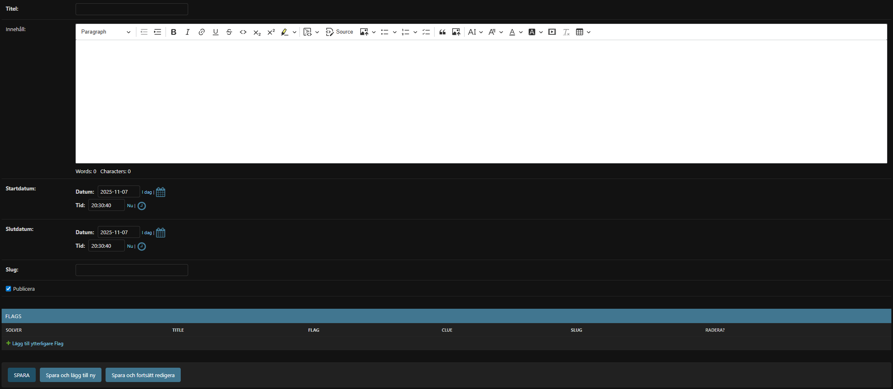

# CTF Admin Guide

## Purpose
Publish capture-the-flag competitions, manage individual flags, and review guesses submitted by members.

## Manage CTF Events
1. Go to **Ctf › Ctfs** in `/admin`.
2. Click **Add ctf** or edit an existing entry.
3. Important fields:
   - **Titel / Innehåll** – shown on `/ctf/` and the detail page (rich text supported).
   - **Startdatum / Slutdatum** – controls when the challenge opens/closes.
   - **Slug** – URL identifier (auto-populate manually, e.g., `vaarctf-2024`).
   - **Publicera** – hide drafts by unchecking.
4. Save to unlock the inline **Flags** table.

## Add Flags to a CTF
1. In the **Flags** inline, click **Add another Flag** for each challenge.
2. Fields include:
   - **Title** – visible name shown on the detail page.
   - **Flag** – the exact secret string that validates the challenge (case-sensitive).
   - **Slug** – used in URLs (`/ctf/<ctf_slug>/<flag_slug>/`).
   - **Content** – CKEditor field text with challenge text and optional hints.
   - **Solver / Solved date** – filled automatically when a member solves the flag. Leave empty when creating.
3. Save the CTF to persist flag entries.

## Review Guesses
- Open **Ctf › Guesses** to see every submitted attempt. Use filters by CTF, flag, user, timestamp, or correctness.
- Incorrect guesses appear with `Correct = False`; correct guesses are duplicated (once for the solver, plus any subsequent attempts made after completion).

## Participant Experience
1. `/ctf/` lists published CTFs ordered by publish date.
2. Each CTF detail page shows all flags. Clicking a flag leads to a submission form where members enter the secret string.
3. Once a member solves any flag, the UI indicates "user_solved" so they know they’re done.

## Tips
- Double-check the flag string before publishing.
- Coordinate start/end times carefully. Members cannot submit outside the window enforced in the view.
- Encourage members to keep flags secret; the app does not prevent sharing beyond recording who submitted what.
