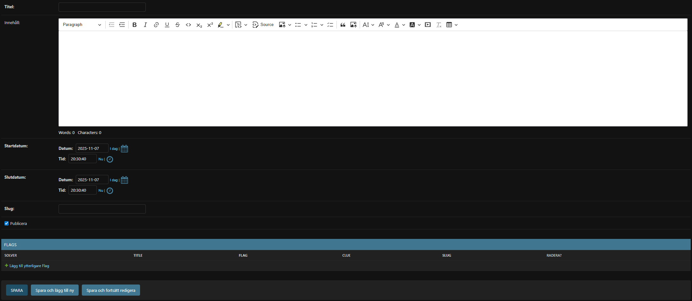

# CTF Admin Guide

## Purpose
Publish capture-the-flag competitions, manage individual flags, and review guesses submitted by members.

## Manage CTF Events
1. Go to **Ctf › Ctfs** in `/admin`.
2. Click **Add ctf** or edit an existing entry.
3. Important fields:
   - **Titel / Innehåll** – shown on `/ctf/` and the detail page (rich text supported).
   - **Startdatum / Slutdatum** – controls when the challenge opens/closes.
   - **Slug** – URL identifier (auto-populate manually, e.g., `vaarctf-2024`).
   - **Publiceras** – timestamp when the CTF should become visible. Leave empty to keep it hidden, or pick a future time to schedule publication; a past time publishes immediately.
4. Save to unlock the inline **Flags** table.

When language features are enabled, **Titel** and **Innehåll** get one tab per language. Swedish is the source version, and a language without its own value falls back to Swedish on the public page. The CTFs list shows the coverage per language, for example `sv: 2/2; en: 1/2`. Flag titles, clues and solutions stay single-language, as do post-mortem overviews.

## Add Flags to a CTF
1. In the **Flags** inline, click **Add another Flag** for each challenge.
2. Fields include:
   - **Title** – visible name shown on the detail page.
   - **Flag** – the exact secret string that validates the challenge (case-sensitive).
   - **Slug** – used in URLs (`/ctf/<ctf_slug>/<flag_slug>/`).
   - **Content** – CKEditor field text with challenge text and optional hints.
   - **Solver** – filled automatically when a member solves the flag. Leave empty when creating; you can also set or change it by hand from the member dropdown to credit a solve manually.
   - **Solved date** – set automatically alongside the automatic solver. Not editable here.
   - **Solution**: the written solution narrative shown on the post-mortem page once the event has ended.
3. Save the CTF to persist flag entries.

## Review Guesses
- Open **Ctf › Ctfs**, then use **All guesses** to see every submitted attempt. Use filters by CTF, flag, user, timestamp, or correctness.
- Incorrect guesses appear with `Correct = False`; correct guesses are duplicated (once for the solver, plus any subsequent attempts made after completion).

## Participant Experience
1. `/ctf/` lists published CTFs ordered by publish date.
2. Each CTF detail page shows all flags. Clicking a flag leads to a submission form where members enter the secret string.
3. Once a member solves any flag, the UI indicates "user_solved" so they know they’re done.

## Publish a Post-Mortem
1. Open the post-mortem list from any of: the **Post-mortems** link above the **Ctf › Ctfs** changelist, the **CTF Post-mortems** entry in the admin sidebar, or **Ctf › Post-mortems** in the model list.
2. Click **Add post-mortem**, pick the CTF, write the **Översikt** (overview) prose, and set **Publiceras**.
3. Write each challenge's **Solution** narrative in the CTF's **Flags** inline. The post-mortem page reads the solutions from the flags, not from the post-mortem itself.
4. Save. **Publiceras** empty means hidden, a future time means scheduled, and a past time means published immediately.

The page becomes readable by any logged-in member once the CTF's **Slutdatum** has passed and the post-mortem is published. Before that, a member who opens the URL gets a plain "not found" page, with nothing to suggest the post-mortem exists.

**Warning:** once the event has ended and the post-mortem is published, every logged-in member can read each challenge's flag string, its solution narrative, and the solver's username. A flag string reused in a later CTF is therefore burned. A published post-mortem can also surface a CTF whose own **Publiceras** is still empty.

CTF editors need one of the CTF content permissions (add or change CTF, add or change flags) to see the post-mortem admin, and anyone explicitly granted a post-mortem model permission also gets in: `ctf.view_postmortem` gives read-only access, while `add`, `change` or `delete` on the post-mortem model give the matching write ability.

The overview prose lives in the post-mortem admin while the challenge narratives live in the CTF's **Flags** inline, so writing the full post-mortem needs write access to flags as well (a normal CTF organizer holds both).

## Tips
- Double-check the flag string before publishing.
- Coordinate start/end times carefully. Members cannot submit outside the window enforced in the view.
- Encourage members to keep flags secret; the app does not prevent sharing beyond recording who submitted what.
